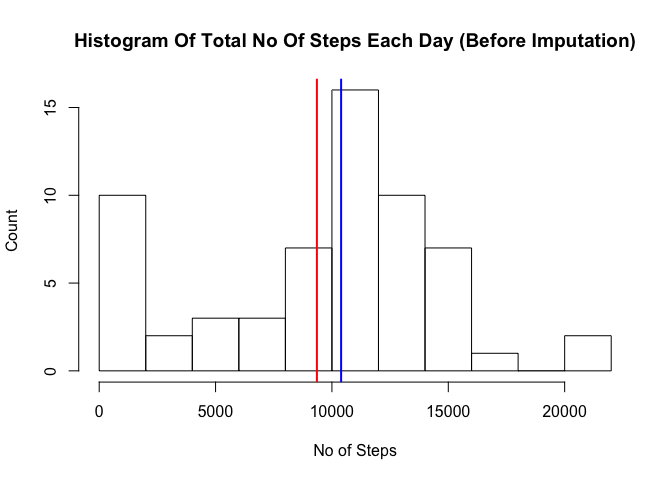

# Reproducible Research: Peer Assessment 1


## Loading and preprocessing the data
First, set the working repository

```r
setwd("/Users/promisinganuj/Data/Technical/R Language/RepData_PeerAssessment1")
```

Now, load the dataset

```r
activity <- read.csv(unz("activity.zip", "activity.csv"), header=TRUE)
```

Let's look at the dataframe "activity"

```r
str(activity)
```

```
## 'data.frame':	17568 obs. of  3 variables:
##  $ steps   : int  NA NA NA NA NA NA NA NA NA NA ...
##  $ date    : Factor w/ 61 levels "2012-10-01","2012-10-02",..: 1 1 1 1 1 1 1 1 1 1 ...
##  $ interval: int  0 5 10 15 20 25 30 35 40 45 ...
```

As expected, it containt 17568 observations of 3 variables. Notice that the date variable is of type "factor". Convert it to "Date" type.


```r
library(lubridate)
activity <- transform(activity, date = ymd(date))
str(activity)
```

```
## 'data.frame':	17568 obs. of  3 variables:
##  $ steps   : int  NA NA NA NA NA NA NA NA NA NA ...
##  $ date    : POSIXct, format: "2012-10-01" "2012-10-01" ...
##  $ interval: int  0 5 10 15 20 25 30 35 40 45 ...
```

Better. Now moving on to the real work.

## What is mean total number of steps taken per day?
For answering this question, we will be using the "dplyr" package just because it's easy and convinenent. Please feel free to make your own pick.


```r
library(dplyr)
activity.bydate <- group_by(activity, date)
activity.bydate.sum <- summarise(activity.bydate, no.of.steps=sum(steps, na.rm=TRUE))
```

Now that we have the summarised dataframe, lets plot a histogram based on that

```r
mean.no.of.steps <- mean(activity.bydate.sum$no.of.steps)
median.no.of.steps <- median(activity.bydate.sum$no.of.steps)
hist(activity.bydate.sum$no.of.steps, xlab="No of Steps", ylab="Count", main = "Histogram Of Total No Of Steps Each Day (Before Imputation)", breaks=10)
abline(v=mean.no.of.steps, col="red", lwd=2)
abline(v=median.no.of.steps, col="blue", lwd=2)
```

 

```
## [1] "Mean (red): 9354.22950819672"
```

```
## [1] "Median (blue): 10395"
```

## What is the average daily activity pattern?
For this pattern, create a plot with "interval" as x-axis and "avg.no.of.steps" (to be computed) as y-axis.

```r
activity.byinterval <- group_by(activity, interval)
activity.byinterval.mean <- summarise(activity.byinterval, avg.no.of.steps = mean(steps, na.rm =TRUE))
with(activity.byinterval.mean, plot(interval, avg.no.of.steps, type="l", xlab = "Interval (5 minute)", ylab = "Average number of steps", main = "Average Daily Activity Pattern"))
```

 

From the above graph, we can see that activity level is peaking during the morning hours which is sort of expected as a lot of poeple do excercise and go to office during morning hours.

Lets find out the interval with maximum number of steps:


```r
maxsteps <- round(max(activity.byinterval.mean$avg.no.of.steps))
interval.maxsteps <- with(activity.byinterval.mean, interval[avg.no.of.steps== max(avg.no.of.steps)])
```

```
## [1] "Interval with maximum number of steps: 835 ; Count = 206"
```

## Imputing missing values

There are missing values in the given dataset, let's find out how many of them are NA.

```r
sum(is.na(activity$steps))
```

```
## [1] 2304
```
So, 2304 of 17568 observations are actual NA. The strategy applied here to fill these gaps is to replace the NA values with the average for the same interval. For that, the data frame "activity.byinterval.mean" is already available. Join it with the "activity" data frame based on column "interval". Now for the "NA" values of "steps" column, just replace it with the mean value of that corresponding period. Finally, dump the last column (avg.no.of.steps).


```r
activity.merged <- merge(activity, activity.byinterval.mean)
activity.merged <- transform(activity.merged, steps = as.factor(ifelse(is.na(steps), round(avg.no.of.steps), steps)))
activity.final <- activity.merged[,c(1:3)]
```

Now that we have complete data frame, let's plot it again as done previously.

```r
library(dplyr)
activity.final.bydate <- group_by(activity.final, date)
activity.final.bydate.sum <- summarise(activity.final.bydate, no.of.steps=sum(steps, na.rm=TRUE))
mean.final.no.of.steps <- mean(activity.final.bydate.sum$no.of.steps)
median.final.no.of.steps <- median(activity.final.bydate.sum$no.of.steps)
hist(activity.final.bydate.sum$no.of.steps, xlab="No of Steps", ylab="Count", main = "Histogram Of Total No Of Steps Each Day (After Imputation)", breaks=10)
abline(v=mean.final.no.of.steps, col="red", lwd=1)
abline(v=median.final.no.of.steps, col="blue", lwd=1)
```

 

```
## [1] "Mean after imputing missing values (red): 10330.6721311475"
```

```
## [1] "Median after imputing missing values (blue): 11044"
```

## Are there differences in activity patterns between weekdays and weekends?
For answering this question, let's add another variable "day.type" indicating weather a particular day is "weekday" or "weekend". Based on this variable, create a plot to compare average activity over the "weekend" and "weekday".


```r
library(ggplot2)
```

```
## Warning: package 'ggplot2' was built under R version 3.1.3
```

```r
activity.final$day.type <- ifelse(weekdays(as.Date(activity.final$date)) %in% c("Saturday", "Sunday"), "weekend", "weekday")

activity.byinterval <- group_by(activity.final, interval, day.type)
activity.byinterval.mean <- summarise(activity.byinterval, avg.no.of.steps = mean(steps, na.rm =TRUE))

ggplot(activity.byinterval.mean, aes(interval, avg.no.of.steps)) + 
    geom_line() + 
    facet_grid(day.type ~ .) +
    xlab("Interval") + 
    ylab("Avarage number of steps")
```

 
 
Base on the above graphs, the following two observations can be made: 

1. People are more active during the morning hours on weekday as compared to weekend. 

2. The overall activity level of people during weekend is higher that that on weekday. It can be attributed to the fact that people are going out on weekend rather than being in office which would increare their overall activity level.

